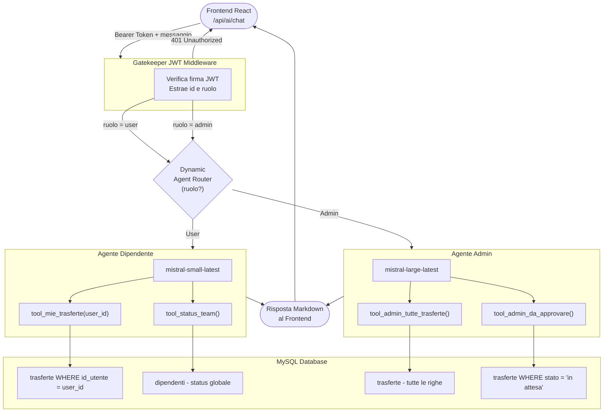

# Business Travel - Gestionale Aziendale Trasferte

<div align="center">
  
  
  
  
  
  
</div>

<p align="center">
  <em>Un gestionale full stack per la gestione delle trasferte aziendali, delle note spese e dell'approvazione dei rimborsi, arricchito da un assistente di intelligenza artificiale basato su LangGraph e Mistral AI.</em>
</p>

---

## Descrizione del Progetto

Business Travel è una piattaforma web di nuova generazione progettata per digitalizzare, centralizzare e semplificare l'intero ciclo di vita delle trasferte aziendali. Automatizzando il flusso end-to-end, dalla richiesta iniziale del dipendente all'approvazione degli amministratori, fino alla rendicontazione finale delle note spese, il sistema elimina la burocrazia cartacea e riduce drasticamente il carico cognitivo degli utenti.
La vera innovazione risiede nell'integrazione nativa di un Assistente Virtuale basato su IA Generativa, accessibile ovunque tramite una chat flottante. Più che un semplice chatbot, si tratta di un vero e proprio agente operativo che comprende il linguaggio naturale e naviga in sicurezza nel database aziendale. L'assistente adotta un approccio dinamico basato sul ruolo dell'utente: supporta i dipendenti nella gestione rapida dei propri viaggi e, al contempo, offre agli amministratori potenti strumenti di controllo del budget, analisi dei trend di spesa e reportistica avanzata.

Il progetto e' composto da quattro servizi distinti orchestrati tramite Docker Compose:

- **frontend**: Single Page Application React per l'interfaccia utente
- **backend**: API REST Node.js/Express per la gestione dei dati principali
- **backend-ai**: Microservizio Python/FastAPI per l'assistente intelligente
- **mysql**: Database relazionale MySQL 8.4

---

## Architettura del Sistema

```
                     +---------------------------+
                     |       Browser/Client      |
                     |   React SPA (porta 5173)  |
                     +----------+----------------+
                                |
               +----------------+----------------+
               |                                 |
               v                                 v
  +-------------------------+       +------------------------+
  | Backend Express         |       | Backend-AI FastAPI     |
  | Node.js 22 (porta 5000) |       | Python 3.13 (porta 8000)|
  |                         |       |                        |
  | - Auth JWT              |       | - LangGraph Agent      |
  | - CRUD Trasferte        |       | - Mistral AI LLM       |
  | - CRUD Spese            |       | - RBAC Tool Routing    |
  | - Gestione Utenti       |       | - JWT Gatekeeper       |
  | - Travel Policies       |       |                        |
  +----------+--------------+       +-----------+------------+
             |                                  |
             +------------------+---------------+
                                |
                     +----------v---------+
                     |   MySQL 8.4        |
                     |  (porta 3306)      |
                     |  database:         |
                     |  businesstravel    |
                     +--------------------+
```

Il frontend comunica in modo indipendente con entrambi i backend. Per le operazioni sui dati (trasferte, spese, utenti) utilizza il backend Express. Per le interazioni con l'assistente IA utilizza direttamente il backend FastAPI.

---

## Funzionalita' Principali

### Gestione Trasferte

I dipendenti possono richiedere nuove trasferte specificando destinazione, date, scopo del viaggio e informazioni di dettaglio. Le richieste transitano attraverso un workflow di approvazione:

- **In attesa**: Appena creata, in attesa di revisione da parte di un amministratore.
- **Approvata**: Il viaggio e' autorizzato.
- **Rifiutata**: La richiesta e' stata respinta con eventuale motivazione.

Gli amministratori hanno una pagina dedicata alle approvazioni che raccoglie tutte le richieste pendenti in un'unica vista.

### Note Spese e Rimborsi

Per ogni trasferta approvata, il dipendente puo' allegare note spese con:

- Categoria della spesa (vitto, alloggio, trasporto, ecc.)
- Importo
- Upload di scontrino o ricevuta (immagine o PDF)
- Verifica automatica del massimale: il sistema calcola in automatico se la spesa supera il limite impostato dalla travel policy della categoria.

Gli amministratori valutano ogni nota spese (approva / rimborsa / rifiuta).

### Gestione Utenti

Gli amministratori possono creare nuovi account dipendenti assegnando credenziali e ruolo, oppure rimuovere utenti esistenti. La visualizzazione del team include lo status in tempo reale (In Sede / In Trasferta) di ciascun dipendente.

### Travel Policies

I massimali di spesa per categoria (es. 50 euro vitto, 150 euro alloggio) sono configurabili dagli amministratori tramite un'interfaccia dedicata. Il backend utilizza questi valori per segnalare automaticamente le spese fuori soglia al momento dell'inserimento.

### Assistente IA Integrato

Un widget di chat flottante e' disponibile in tutte le pagine dell'applicazione per tutti gli utenti autenticati. L'assistente e' basato su un sistema Multi-Agente con routing dinamico basato sul ruolo:

- I **dipendenti** interagiscono con un agente leggero (Mistral Small) che puo' interrogare solo i propri dati di viaggio e lo status generico del team.
- Gli **amministratori** interagiscono con un agente avanzato (Mistral Large) che ha accesso all'intero database aziendale per reportistica e analisi.

---

## Struttura del Repository

```
404Team_ProgettoFinale/
├── frontend/          # React 19 + Vite + Tailwind CSS
├── backend/           # Node.js 22 + Express + JWT + MySQL
├── backend-ai/        # Python 3.13 + FastAPI + LangGraph + Mistral AI
├── docker-compose.yml # Orchestrazione completa dei servizi
├── .gitignore
└── README.md
```

Ogni sottodirectory ha il proprio README con documentazione dettagliata:

- [backend/README.md](./backend/README.md) - API Reference, middleware, sicurezza
- [frontend/README.md](./frontend/README.md) - Routing, componenti, struttura pagine
- [backend-ai/README.md](./backend-ai/README.md) - Architettura Multi-Agente, grafo LangGraph

---

## Sicurezza

### Autenticazione JWT

Il sistema utilizza JSON Web Token per autenticare le richieste. Il token viene generato al login dal backend Express, firmato con una chiave segreta (`JWT_SECRET`) e restituito al client.

Il token viene accettato sia come cookie HttpOnly che come header `Authorization: Bearer`, garantendo flessibilita' tra richieste browser standard e chiamate API dirette (come quelle del microservizio IA).

### Controllo Accessi Basato sui Ruoli (RBAC)

Ogni operazione sensibile e' protetta a due livelli:

1. **Backend Express**: Il middleware `verifyToken` verifica il JWT su tutte le rotte protette. Il middleware `checkRole` aggiunge un secondo controllo sul ruolo per le operazioni riservate agli amministratori (creazione/eliminazione utenti, valutazione spese).

2. **Backend IA**: Il gatekeeper JWT del microservizio FastAPI verifica e decodifica il token in modo indipendente, estraendo il ruolo senza fidarsi di nessuna informazione proveniente dal client. Il ruolo estratto determina quale agente IA viene istanziato e quali strumenti di interrogazione del database vengono caricati in memoria. Un dipendente non puo' mai accedere agli strumenti dell'agente admin, nemmeno manipolando la richiesta.

3. **Isolamento dei Dati**: Le query SQL degli strumenti dell'agente utente filtrano sempre i dati con `WHERE id_utente = %s`, rendendo impossibile per un agente accedere a dati di altri utenti anche in caso di prompt injection.

### Password

Le password sono memorizzate esclusivamente come hash bcrypt. Il confronto avviene sempre tramite `bcrypt.compare()`.

---

## Stack Tecnologico Completo

### Frontend

| Tecnologia        | Versione | Ruolo                                  |
|-------------------|----------|----------------------------------------|
| React             | 19       | Libreria UI                            |
| Vite              | 8.x      | Build tool e dev server                |
| react-router-dom  | 7.x      | Routing SPA                            |
| Zustand           | 5.x      | State management                       |
| Tailwind CSS      | 4.x      | Framework CSS utility-first            |
| Material UI       | 9.x      | Componenti UI aggiuntivi               |
| Axios             | 1.x      | Client HTTP                            |
| react-hook-form   | 7.x      | Gestione form                          |
| react-markdown    | 10.x     | Rendering Markdown                     |
| lucide-react      | 1.x      | Icone SVG                              |

### Backend Express

| Tecnologia    | Versione | Ruolo                              |
|---------------|----------|------------------------------------|
| Node.js       | 22       | Runtime                            |
| Express       | 4.x      | Framework HTTP                     |
| mysql2        | 3.x      | Driver MySQL con Promise e Pool    |
| jsonwebtoken  | 9.x      | Generazione e verifica JWT         |
| bcryptjs      | 2.x      | Hashing password                   |
| multer        | 1.x      | Upload file multipart              |
| cookie-parser | 1.x      | Parsing cookie HttpOnly            |
| cors          | 2.x      | Cross-Origin Resource Sharing      |

### Backend IA

| Tecnologia           | Versione | Ruolo                                     |
|----------------------|----------|-------------------------------------------|
| Python               | 3.13     | Runtime                                   |
| FastAPI              | 0.100+   | Framework HTTP asincrono                  |
| LangGraph            | latest   | Orchestrazione agenti Multi-Agente        |
| LangChain Mistral AI | latest   | Integrazione con i modelli Mistral        |
| Mistral AI           | Small / Large | Modelli LLM con tool calling        |
| PyJWT                | latest   | Verifica firma JWT lato Python            |
| mysql-connector-python | latest | Driver MySQL nativo Python               |
| python-dotenv        | latest   | Gestione variabili di ambiente            |
| uvicorn              | latest   | Server ASGI per FastAPI                   |

### Infrastruttura

| Tecnologia    | Versione | Ruolo                        |
|---------------|----------|------------------------------|
| Docker        | -        | Containerizzazione servizi   |
| Docker Compose| -        | Orchestrazione multi-container|
| MySQL         | 8.4      | Database relazionale         |

---

## Avvio Rapido con Docker Compose

### Prerequisiti

- Docker Desktop installato e in esecuzione
- Una chiave API Mistral AI valida (per il modulo IA)

### Configurazione

1. Clona il repository:

```bash
git clone https://github.com/realKevv/404Team_ProgettoFinale.git
cd 404Team_ProgettoFinale
```

2. Crea il file `.env` per il microservizio IA:

```bash
cd backend-ai
cp .env.example .env
```

Compila le variabili nel file `backend-ai/.env`:

```env
DB_HOST=mysql
DB_PORT=3306
DB_USER=root
DB_PASSWORD=root
DB_NAME=businesstravel
JWT_SECRET=la_tua_chiave_segreta_molto_lunga
MISTRAL_API_KEY=la_tua_chiave_api_mistral
```

3. Crea il file `.env` per il backend Express:

```bash
cd ../backend
cp .env.example .env
```

Compila le variabili nel file `backend/.env`:

```env
PORT=5000
DB_HOST=mysql
DB_PORT=3306
DB_USER=root
DB_PASSWORD=root
DB_NAME=businesstravel
JWT_SECRET=la_tua_chiave_segreta_molto_lunga
```

**Attenzione:** Il valore di `JWT_SECRET` deve essere identico nei due file `.env`.

4. Torna alla radice del progetto e avvia tutti i servizi:

```bash
cd ..
docker compose up --build
```

### Accesso ai Servizi

Dopo l'avvio, i servizi sono disponibili ai seguenti indirizzi:

| Servizio        | URL                          |
|-----------------|------------------------------|
| Frontend        | http://localhost:5173        |
| Backend Express | http://localhost:5000        |
| Backend IA      | http://localhost:8000        |
| MySQL           | localhost:3306               |

---

## Avvio Manuale (senza Docker)

Se si preferisce avviare i servizi singolarmente senza Docker, e' necessario avere MySQL in esecuzione localmente e configurare i file `.env` di ogni sottoprogetto con `DB_HOST=localhost`.

### Backend Express

```bash
cd backend
npm install
npm run dev
```

### Backend IA

```bash
cd backend-ai
python -m venv venv
venv\Scripts\activate          # Windows
# source venv/bin/activate     # Linux/macOS
pip install -r requirements.txt
uvicorn main:app --reload --port 8000
```

### Frontend

```bash
cd frontend
npm install
npm run dev
```

---

## Schema del Database

Il database `businesstravel` e' un database MySQL relazionale. Le tabelle principali che il sistema gestisce sono:

- **utenti**: Anagrafica dipendenti con credenziali (password hashata), ruolo e stato.
- **trasferte**: Richieste di trasferta con destinazione, date, stato di approvazione e riferimento all'utente.
- **spese**: Note spese collegate a una trasferta con importo, categoria, path dello scontrino allegato e stato di rimborso.
- **policies**: Massimali di spesa configurabili per categoria (uno per categoria).

---

## Flusso di una Trasferta

```
Dipendente crea richiesta
         |
         v
  [Stato: "in attesa"]
         |
         v
  Admin visualizza lista approvazioni
         |
    +----+----+
    |         |
    v         v
Approva    Rifiuta
    |         |
    v         v
[Approvata] [Rifiutata]
    |
    v
Dipendente aggiunge note spese
(con upload scontrino)
    |
    v
Admin valuta ogni spesa
(approva rimborso / rifiuta)
```

---

## Architettura del Modulo IA

Il microservizio `backend-ai` implementa un sistema Multi-Agente con le seguenti caratteristiche:

### Gatekeeper JWT

Ogni richiesta al microservizio IA e' protetta da un middleware FastAPI che verifica la firma del JWT con la stessa chiave segreta usata dal backend Express (`JWT_SECRET`). L'identita' e il ruolo dell'utente vengono estratti dal token lato server: il client non puo' dichiarare autonomamente il proprio ruolo.

### Dynamic Agent Routing

In base al ruolo estratto dal token, il sistema `core/agent.py` istanzia al volo due agenti completamente separati:

**Agente Dipendente (ruolo: user)**
- Modello LLM: `mistral-small-latest` (veloce, ottimizzato per risposte immediate)
- Strumenti disponibili:
  - `tool_mie_trasferte(user_id)`: interroga le trasferte del solo utente loggato
  - `tool_status_team()`: restituisce la disponibilita' generica dei colleghi senza dati sensibili
- System prompt orientato all'assistenza personale e alla leggibilita'

**Agente Amministratore (ruolo: admin)**
- Modello LLM: `mistral-large-latest` (potente, per analisi e reportistica complessa)
- Strumenti disponibili:
  - `tool_admin_tutte_trasferte()`: accesso all'intero dataset aziendale
  - `tool_admin_da_approvare()`: lista filtrara delle richieste pendenti
- System prompt orientato all'analisi dati e alla gestione operativa

### Grafo LangGraph



---

## Note Aggiuntive

### CORS

Il backend Express e' configurato con `cors({ origin: true, credentials: true })` per accettare richieste con credenziali da qualsiasi origine (configurazione adatta allo sviluppo locale). Il microservizio FastAPI ha `allow_origins=["*"]`. In un ambiente di produzione, entrambi i valori devono essere ristretti all'URL del frontend.

### Upload di File

I file caricati tramite le note spese vengono salvati in `backend/public/uploads/` e serviti come file statici dal backend Express tramite `express.static`. La cartella viene creata automaticamente al primo avvio se non esiste.

### Retry della Connessione al Database

Il backend Express include una logica di retry con 10 tentativi e 3 secondi di attesa tra l'uno e l'altro. Questo garantisce l'avvio corretto in Docker anche quando il container MySQL impiega qualche secondo a essere pronto.

---
## Sviluppi futuri
Potenziare il sistema di IA con un agente esperto per analisi di bilancio aziendale e approvazione di trasferte.

Quando l'utente carica la foto dello scontrino, l'IA "legge" l'immagine ed estrae in automatico data, importo, valuta e fornitore, precompilando il form ed eliminando l'inserimento manuale.

Analisi Predittiva sui Budget: Sfruttare lo storico dei dati su MySQL per far prevedere all'IA i costi futuri delle trasferte in un determinato periodo dell'anno, aiutando l'amministrazione ad allocare il budget.

Applicazione Mobile Nativa: Sfruttare le conoscenze in React per migrare il frontend verso React Native. Questo permetterebbe di avere un'app iOS/Android con accesso nativo alla fotocamera per scattare foto agli scontrini in tempo reale.

Funzionamento Offline: Implementare logiche Mobile-First per permettere ai dipendenti di salvare le spese sull'app anche senza connessione internet (es. in aereo o all'estero), sincronizzando automaticamente i dati con il database non appena torna il segnale

Interfacciamento con Sistemi Esterni: Creare API dedicate per far dialogare il tuo gestionale direttamente con i software di contabilità aziendale (es. SAP, Zucchetti, Teamsystem). Quando una spesa viene approvata dall'Admin, l'importo finisce automaticamente in busta paga per il rimborso.


---
## Team di Sviluppo
Progetto sviluppato per il Progetto Finale WebAcademy 2026.
**404Team**
- [Kevin Napoli](https://www.linkedin.com/in/kevin-napoli-446b35314/ ) - Backend IA (FastAPI, LangGraph, Mistral), Backend Express, Frontend React
- [Jose Alexander Yepez Mejia](https://www.linkedin.com/in/jose-alexander-yepez-mejia-960b263b2/) - Backend Express, Frontend React
- [Bianca Andreea Ciocoiu](https://www.linkedin.com/in/bianca-andreea-ciocoiu-a630663bb/ ) - Frontend React
- [Maria Carlotta Liberio](https://www.linkedin.com/in/maria-carlotta-liberio-11242b235/) - Frontend React


<div align="center">
  <b>404Team - Progetto Finale WebAcademy 2026</b>
</div>
