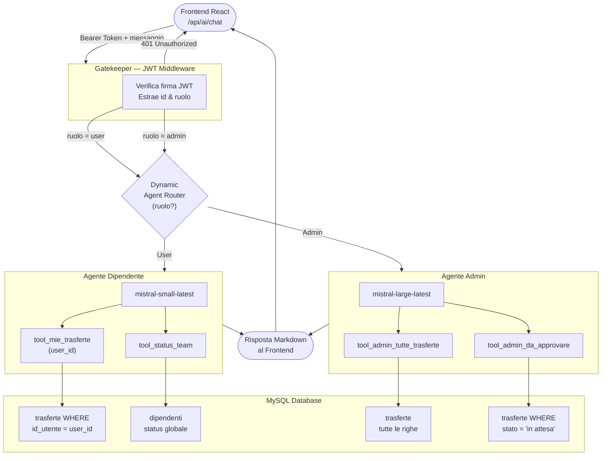

#  Business Travel AI

<div align="center">
  
  
  
</div>

<p align="center">
  <em>Il modulo di Intelligenza Artificiale integrato nel gestionale Business Travel, progettato per offrire un'assistenza intelligente, sicura e basata sui ruoli aziendali.</em>
</p>

---

##  Architettura del Sistema
Il sistema adotta un'architettura **Multi-Agente** orchestrata tramite **LangGraph**, garantendo un flusso di elaborazione modulare e performante:

- **Gatekeeper (Middleware JWT)**: Ogni richiesta è protetta da un token JWT. Il backend decodifica l'identità dell'utente in modo sicuro, rendendo impossibile la manipolazione lato client.
- **Dynamic Agent Routing**: In base al ruolo estratto dal token (*User* o *Admin*), il sistema istanzia un agente dedicato con:
  - **Modello LLM specifico**: `mistral-small` per risposte istantanee (User), `mistral-large` per analisi complesse (Admin).
  - **Tooling dedicato**: Vengono iniettati in memoria solo gli strumenti permessi dal profilo utente (*RBAC - Role Based Access Control*).
- **Execution Layer**: L'agente interagisce con il database MySQL tramite funzioni protette che filtrano i dati a monte (es. `WHERE id_utente = %s`), garantendo l'assoluto isolamento dei dati sensibili.

---

##  Grafo degli Agenti



---

##  Caratteristiche Funzionali

###  Dipendente (User)
* **Assistenza Personale**: Interrogazione sicura e privata sulle proprie trasferte.
* **Status Team**: Consultazione in tempo reale della disponibilità dei colleghi.
* **UX Ottimizzata**: Risposte formattate con Markdown, emoji e layout ariosi per la massima leggibilità.

###  Amministratore (Admin)
* **Visione Globale**: Accesso all'intero database aziendale per reportistica e analisi.
* **Gestione Flussi**: Gestione centralizzata delle richieste in attesa di approvazione.
* **Analisi Avanzata**: Elaborazione di dati complessi tramite il modello Mistral ad alte prestazioni.

---

##   Sicurezza: Architettura Zero Trust
L'accesso all'IA è basato sul principio che **non ci fidiamo mai del frontend**.
- **Autenticazione**: Verifica rigorosa della firma JWT lato backend.
- **Isolamento Dati**: Nessun privilegio di accesso è gestito o delegato al client.
- **Prompt Engineering**: I *System Prompt* definiscono in modo ferreo le "maschere" comportamentali degli agenti, impedendo la fuoriuscita di informazioni non autorizzate.

---

## Stack Tecnologico
* **Backend:** Python 3.13, FastAPI, PyJWT, LangChain, LangGraph
* **Intelligenza Artificiale:** Mistral AI (Models: `small-latest`, `large-latest`)
* **Frontend:** React, Zustand, Tailwind CSS, React-Markdown
* **Database:** MySQL, mysql-connector-python

---

##  Setup & Avvio

1. **Clona il repository** e spostati in questa cartella.
2. **Installa le dipendenze**:
   ```bash
   pip install fastapi uvicorn langchain-mistralai langgraph pyjwt mysql-connector-python
   ```
3. **Configura il file `.env`**:
   Assicurati di inserire il `JWT_SECRET` (identico a quello del backend Node.js) e le credenziali del Database.
4. **Avvia il server**:
   ```bash
   uvicorn main:app --reload
   ```

---
<div align="center">
  <b>Progetto sviluppato per il Progetto Finale 404Team © 2026</b><br>
  <i>by <a href="https://github.com/realKevv" target="_blank">RealKevv</a></i>
</div>